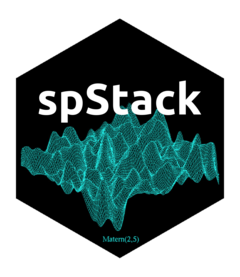

# spStack <a href="https://span-18.github.io/spStack-dev/"></a>

<!-- badges: start -->
[](https://CRAN.R-project.org/package=spStack)
[](https://CRAN.R-project.org/package=spStack)
[](https://github.com/SPan-18/spStack-dev/actions/workflows/Standard-CI.yaml)
<!-- badges: end -->

## Overview
spStack is an R package that delivers Bayesian inference for point-referenced spatial data by assimilating posterior inference over a collection of candidate models using stacking of predictive densities. Currently, it supports point-referenced Gaussian, Poisson, binomial and binary outcomes. Users can supply candidate values of spatial process parameters and certain auxiliary model parameters, based on which the collection of models will be created. spStack utilizes the Bayesian conjugate linear modelling framework for Gaussian data and the generalized conjugate multivariate distribution theory for non-Gaussian exponential family data. Learn more in `vignette("spStack")`. Technical details of the methodology are available in [Zhang, Tang, and Banerjee 2024](https://doi.org/10.48550/arXiv.2304.12414) and [Pan, Zhang, Bradley, and, Banerjee 2024](https://doi.org/10.48550/arXiv.2406.04655).

## Installation
For a quick installation of the development version, run the following command in R.
```r
# Install development version from GitHub
# install.packages("pak")
pak::pak("SPan-18/spStack-dev")
```
If installing from CRAN, use the following.
```r
install.packages("spStack")
```

### Installing from source
To install the package from source, download the tarball *spStack_X.X.XX.tar.gz* file. After setting the working directory at the file location, either issue `R CMD install spStack_X.X.XX.tar.gz` in the terminal, or run the following command in R to install the package.
```r
install.packages("spStack_X.X.XX.tar.gz", type = "source", repos = NULL)
```

Note that the package is written in C++ with calls to FORTRAN routines and hence contains a `Makevars` file for cross-platform portability. So, it is important to set the correct path to FORTRAN libraries as well as BLAS and LAPACK on your computer. For example, if you are working on MacOS, create a file `~.R/Makevars` and set global configurations for the libraries to link with R. The following is an example of such a Makevars file.
```bash
# Set Fortran library paths
FLIBS = -L/opt/homebrew/opt/gcc/lib/gcc/14 -lgfortran -lquadmath -lm

# BLAS and LAPACK libraries (using Accelerate framework on macOS)
BLAS_LIBS = -L/System/Library/Frameworks/Accelerate.framework/Versions/Current/ -framework Accelerate
LAPACK_LIBS = -L/System/Library/Frameworks/Accelerate.framework/Versions/Current/ -framework Accelerate
```
It tells R to use the Accelerate framework, that comes pre-installed with Mac for BLAS and LAPACK functions. If you do not have `gfortran`, simply run `brew install gcc` on the terminal which will install the `gcc` compiler and `gfortran` comes bundled with `gcc`. If `gcc` is installed using Homebrew, then the path should be the same as above, otherwise the path for `gfortran` needs to set correctly.

## Usage
Once successfully installed, load the library in R.
```r
library(spStack)
```
View the vignette by running `vignette("spStack")` and see example code to implement predictive stacking for different Bayesian hierarchical spatial models.

## Acknowledgement
The graphics used in the logo has been obtained from the page [Gaussian RF](https://www.math.umd.edu/~bnk/CLIP/clip.gauss.htm) (Boris Kozintsev, 1999). It represents a realization of an isotropic Gaussian random field under the Matérn correlation function with decay and smoothness parameters 5 and 2, respectively.
